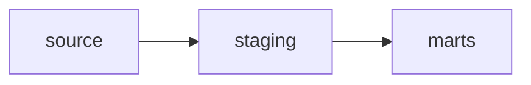

# Single source per staging model

There are staging script(s) that have multiple source inputs.


When a staging script depends on a source, it should be a one-to-one mapping. This allows for any renaming or casting from the source system to be done in one place.

# No rejoin models

These models are taking part in rejoins.


The example above shows that `A` is rejoined into `C`. This probably means that something is missing in `B`.

# No disabled models

There are disabled scripts.

If you have disabled a script that you no longer require, you should probably delete it.
Assuming that you have your dbt scripts under version control, you can always retrieve the script if you need it in future.

# No orphaned models

There are model(s) that have become disconnected and have no resolvable dependencies.


This can be caused by:

- Hard-coded references to scripts
- The use of `target_project()` to reference a script
- A script that compiles to no content (e.g. an empty file or a macro)

When referencing dependencies, you should use:

- `source()` for sources (https://docs.getdbt.com/docs/using-sources)
- `ref()` for models (https://docs.getdbt.com/docs/ref)

e.g.:

```sql
SELECT *
FROM {{ source('source_name', 'table_name') }}

SELECT *
FROM {{ ref('script_name') }}
```


# No references outside of its own staging area
There are staging model(s) referencing a staging model that belongs in a different area

If you want to cross areas, this should be done at mart level.

# No references to marts from staging

There are staging model(s) referencing a mart model.


Data should be flowing from source centric to business centric areas like so:



# No references to source from marts
There are mart model(s) referencing a source. 


Data should be flowing from source centric to business centric areas like so:


# No owner on physical models
There are physical models without a designated owner. Physical models consist of the following:
- sources
- table materialization
- view materialization
- incremental materialization

To ensure ownership and proper cataloguing of data is preserved, fill in all your physical models with the owner tag as described in the [Dbt reference](https://docs.getdbt.com/reference/resource-properties/meta/#designate-a-model-owner)
